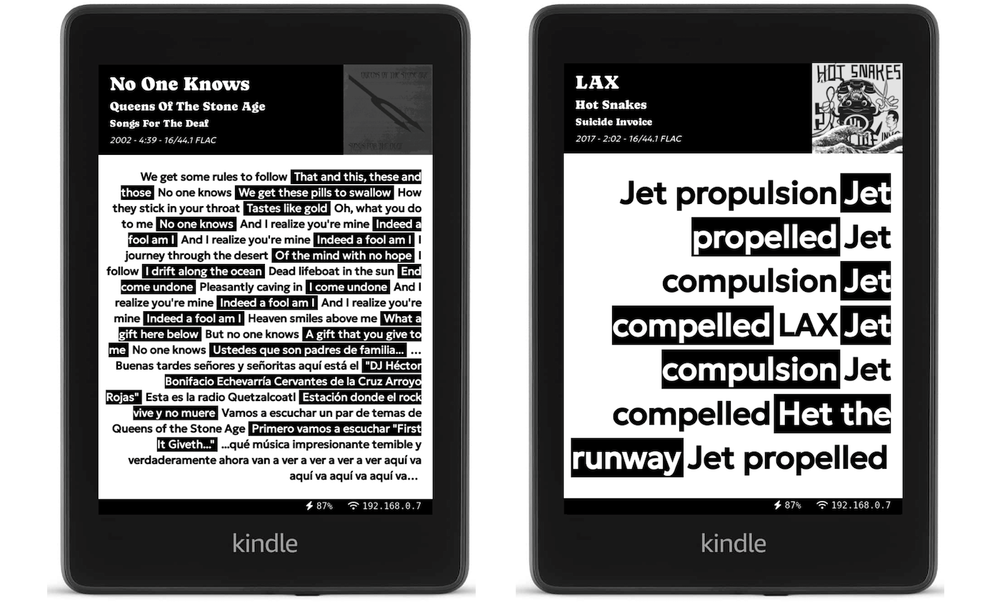

# Koode

Koode is a Moode Audio client that serves a Kindle with current playing lyrics.

You will need a jailbroken kindle with SSH access.

It looks like this:

# Requirements

* [Moode Audio](https://github.com/moode-player/moode) server running in your LAN

* Jailbroken Kindle with SSH access (to install update script)

* A server where to run Koode service (I use a Raspberry Pi - same as Moode)

* Genius api key (to retrieve lyrics) - it's free see below

# Setup

## install imagemagick:

    sudo apt-get install imagemagick

## install dependencies:

    npm install

## configuration:

You can modify your moode server url in config.js

You can also modify the port this is running on (remember to edit script.sh to match)

At minimum you need to set a Genius API key in the variable GENIUS_ACCESS_TOKEN

To get an access token go to https://genius.com/api-clients
Login and copy "CLIENT ACCESS TOKEN"

## run server:

    npm start

Test it on https://[koode-server-ip]:8080

## jailbreak kindle and ssh to it:

Reference: https://wiki.mobileread.com/wiki/Kindle4NTHacking#SSH

This is for kindle 4, if you own other kindle you will have to find
your own jailbreak (that page is a good starting point)

## install kindle script:

ssh to your kindle

    mntroot rw         #make root partition writable
    cd /mnt/us
    nano script.sh

Copy the contents of kindle-script/script.sh to your new file, save it

Inside script.sh edit the SERVER variable to match the local ip and port where
you have Koode running

Run it with:
    ./script.sh

If everything went right this will start querying Koode from your kindle to test if a new song is being played if so, it saves the result and sets show it on the screen automatically

# Customization

The frontend uses mustache templates so you can customize your html and styles.

For a preview just go to [koode-server-ip]:8080 (or wherever you are running the server).

Also in [koode-server-ip]:8080/image you can preview the image in black and white.

# Notes on UI choices
    
As you see in the screenshots provided UI choices were done to be able
to show long lyrics in a single page on kindle, since it works as a screesaver
buttons doesn't work so we have one single page.

So a strategy was adopted to facilitate reading, we make it so that every line is
show with as blackwhite for contrast. This way we can show them all togheter.

Lyrics are right aligned b/c in my experience they where easier to read,
but you can edit tempalte/styles.css to match your tastes.

The lyrics font is automatically (see fit.js) adjusted to take all available
space, so short lyrics will look bigger.

# Credits

This project was inspired on [This Blog Post](https://matthealy.com/kindle) where you can find additional information on how to Jailbreak your kindle.

Note that with Koode a cron job is not needed since the script runs continually (but you can run it at startup as a background process).